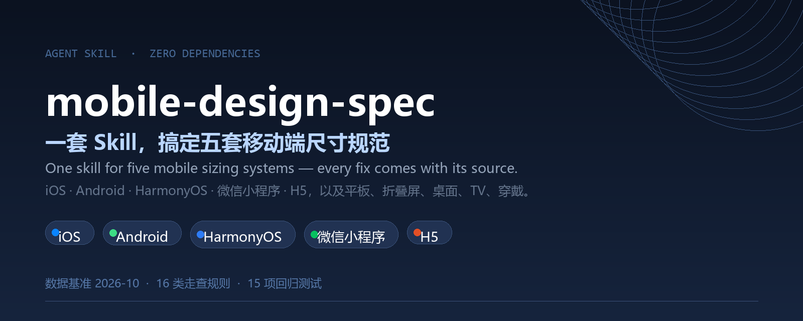
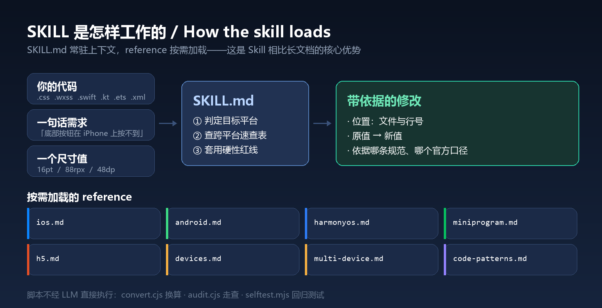
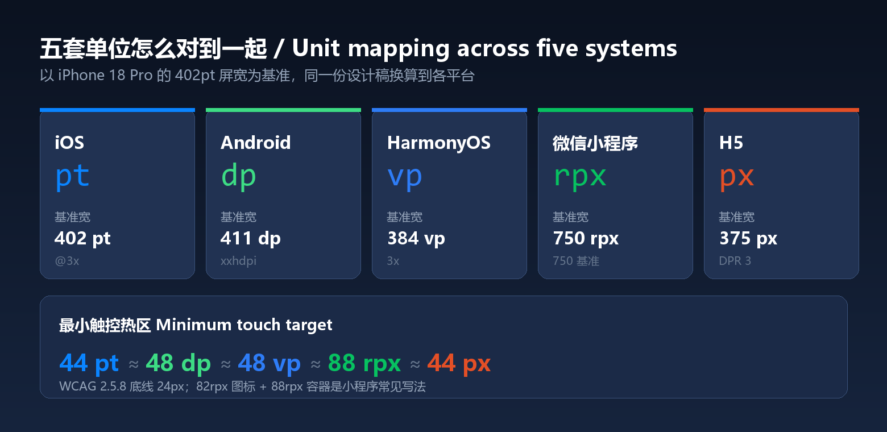
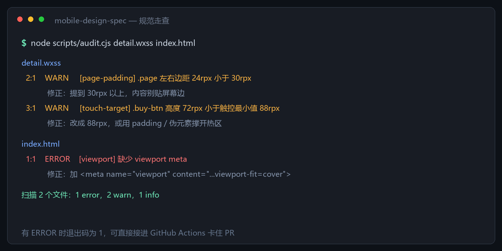

<div align="center">



**一套 Skill，搞定五套移动端尺寸规范**

[](LICENSE)
[](#30-秒上手)
[](package.json)
[](#覆盖范围)
[](#数据基准与时效性)
[](#测试与-ci)

**中文** · [English](README.en.md)

</div>

---

> 让 AI 编码助手按 Apple HIG、Material Design 3、HarmonyOS Design、微信小程序文档和 WCAG 的公开数值，直接改对移动端与响应式代码里的尺寸，并说得出每一条改动的依据。

A Qoder / Claude Code Skill that applies real mobile sizing specs (iOS, Android, HarmonyOS, WeChat Mini Program, H5, plus tablet / desktop / TV / wearable) to your code, with a zero-dependency unit converter and spec linter.

## 目录

- [解决什么问题](#解决什么问题)
- [工作方式](#工作方式)
- [覆盖范围](#覆盖范围)
- [五套单位对照](#五套单位对照)
- [30 秒上手](#30-秒上手)
- [安装](#安装)
- [怎么调用](#怎么调用)
- [走查规则清单](#走查规则清单)
- [数据基准与时效性](#数据基准与时效性)
- [机型为什么是这几台](#机型为什么是这几台)
- [数据来自哪里](#数据来自哪里)
- [数据文件与溯源](#数据文件与溯源)
- [项目结构](#项目结构)
- [测试与 CI](#测试与-ci)
- [已知局限](#已知局限)
- [排错](#排错)
- [贡献](#贡献)
- [许可](#许可)

## 解决什么问题

移动端做界面时反复出现的那几类问题：

- 底部悬浮按钮被 iPhone 手势条挡住，用户"怎么都按不到"
- 可点区域只有 24px，视觉稿看着没问题，手指点不准
- 设计稿按 402pt 出，代码里抄了 Android 的 dp 数值
- 小程序里混用固定 px，换台机器布局就散
- 鸿蒙字体写成 vp，用户放大系统字号后文字不跟随
- 折叠屏内屏和平板直接放大手机版，两侧全是空白
- 标注只写"间距 16"，不写单位、平台和倍率，开发只能猜

它不是给你一份读完就忘的文档，而是让 agent 读完规范后动手改代码，并按"位置 → 原值 → 新值 → 依据"汇报：

```
submit-btn 高度 72rpx → 88rpx   依据: 小程序最小触控 88 x 88rpx (由 Apple 44pt 推得, 官方无明文)
.page 左右边距 24rpx → 32rpx    依据: 微信推荐页面内容左右边距 30 ~ 32rpx
Text fontSize '16vp' → 16       依据: 鸿蒙 fp 才跟随 Configuration.fontSizeScale 缩放
```

## 工作方式



SKILL.md 是常驻上下文的决策入口（约 150 行），负责判定平台、查跨平台速查表、套用硬性红线；八份 reference 只在实际需要时读进来——这是 Skill 相比长文档的核心优势。两个脚本不经 LLM，可以直接在命令行执行。

## 覆盖范围

| 形态 | 平台 | 关键数值 |
| --- | --- | --- |
| 手机 | iOS / Android / HarmonyOS / 微信小程序 / H5 | 主稿 402pt、411dp、384vp、750rpx、375px |
| 平板 | iPadOS、Android 平板、鸿蒙平板 | ≥ 600dp 双栏、≥ 840dp 12 列、iPad 820 x 1180pt |
| 折叠与三折叠 | Galaxy Z Fold、Pixel Fold、Mate X / XT 非凡大师、iPhone Duo | 外屏 323 ~ 360，展开 440 ~ 1108 |
| 桌面与笔记本 | macOS、Chromebook、鸿蒙 PC | macOS 正文 13pt、Chromebook 窗口最小 300 x 450dp |
| 客厅与空间计算 | tvOS、visionOS | tvOS 内容内缩上下 60 左右 80pt、visionOS 可点 60pt |
| 穿戴 | watchOS、鸿蒙穿戴 | 相对缩放 90% ~ 119%、穿戴边距 26vp |
| Web | 移动优先 + 桌面断点 | Tailwind / Bootstrap / MDC 三套实际阈值 |

## 五套单位对照



同一份设计稿换到不同平台，基准屏宽和单位都不一样。`convert.cjs` 做等比映射并给出取整建议与切图物理像素，下面这组最常用的触控下限关系可以直接记：

```
44 pt  ≈  48 dp  ≈  48 vp  ≈  88 rpx  ≈  44 px
```

## 30 秒上手

```bash
git clone https://github.com/YardonYan/mobile-design-spec.git
cd mobile-design-spec
npm test                       # 15 项回归测试, 无需安装依赖
node scripts/convert.cjs 88rpx --to pt,dp,vp
node scripts/audit.cjs 你的样式目录
```

要在 agent 里用，把整个目录放进它的 skills 目录，见下一节。

## 安装

### 用安装器（推荐）

仓库自带一个零依赖的安装脚本，把它装到本机各个 AI 应用的 skills 目录，不需要手工拷贝：

```bash
node tools/install.mjs --list                 # 看有哪些目标可选
node tools/install.mjs --ai workbuddy         # 装到 WorkBuddy
node tools/install.mjs --ai workbuddy --ai trae-cn --ai codebuddy   # 一次装多个
node tools/install.mjs --ai all               # 装到全部目标
node tools/install.mjs --ai all --dry-run     # 只预览，不写文件
node tools/install.mjs --ai all --force       # 覆盖已存在的旧版本
node tools/install.mjs --ai workbuddy --uninstall   # 卸载
```

已核对存在的目标：WorkBuddy、TRAE 国内版、CodeBuddy、Claude Code、Codex CLI、OpenClaw、Qwen Code、cc-switch。`cursor` 与通用 `.agents` 用的是通行约定，未在本机核对。

加 `--project` 改为装进当前项目的相对目录（如 `.workbuddy/skills`），适合随项目一起提交的用法。

安装器只依赖 Node 标准库，会跳过 `.git`、`node_modules`、缓存等目录；装之前先检查 `SKILL.md` 是否在仓库根目录，不在就报错退出。

### 作为插件安装（WorkBuddy / CodeBuddy / Claude Code）

仓库根目录带 `.codebuddy-plugin/` 与 `.claude-plugin/` 两份清单，可以直接注册成一个「单插件市场」，在应用里按插件方式安装，不用手工拷目录。

清单的字段名与取值是照着应用自带的插件清单写的，不是自己发明的格式。**文件格式已逐字段对照应用自带的市场核对；注册与加载的端到端流程未做验证**，注册入口以你所装版本的界面为准。

改过 `SKILL.md` 的 name 或版本号之后重新生成：

```bash
node tools/build_plugins.mjs .
```

### 手工安装

| 环境 | 做法 |
| --- | --- |
| Qoder (用户级) | `mkdir -p ~/.qoder-cn/skills` 后建链接：见下方命令 |
| Qoder (项目级) | 复制到 `<项目>/.qoder/skills/mobile-design-spec` |
| Claude Code | 复制到 `~/.claude/skills/mobile-design-spec`（同为 `SKILL.md` + frontmatter 格式） |
| 其他 agent | 把 `SKILL.md` 正文并入系统提示或 rules 文件；两个脚本不依赖任何 agent 环境，可单独调用 |

```bash
# Windows: 目录联接, 不需要管理员权限, 改源文件即时生效
mkdir "%USERPROFILE%\.qoder-cn\skills" 2>nul
mklink /J "%USERPROFILE%\.qoder-cn\skills\mobile-design-spec" "<你克隆到的路径>\mobile-design-spec"

# macOS / Linux
mkdir -p ~/.qoder-cn/skills
ln -s "$PWD/mobile-design-spec" ~/.qoder-cn/skills/mobile-design-spec
```

装完 `/skills reload` 或重启会话，`/skills list` 里能看到 `mobile-design-spec`。

## 怎么调用

### 1. 斜杠命令

```
/mobile-design-spec src/pages/order
/mobile-design-spec 16pt
```

### 2. 自然语言（会自动命中）

下面这些说法都能触发，写 issue 时可以直接抄：

- "这个页面的底部按钮在 iPhone 上按不到，帮我按规范改一下"
- "把这份设计稿的标注换算成 Android 和鸿蒙两套"
- "检查一下这个小程序页面的字号和触控热区有没有不达标"
- "折叠屏展开后布局很空，按大屏规范改成双栏"
- "iPad 11 寸和 13 寸的分辨率和安全区高度分别是多少"
- "这个 H5 页面在 iOS Safari 上底部被地址栏挡住，怎么处理"

### 3. 命令行

单位换算，跨五套基准等比映射，并给出切图物理像素：

```console
$ node scripts/convert.cjs 88rpx --to pt,dp,vp
输入 88rpx  (源设计稿宽 750, 占屏宽 11.73%)
等比换算   pt 47.17 | dp 48.22 | vp 45.06
取整建议   pt 47 | dp 48 | vp 45
切图物理   @2x 176px | @3x 264px
触控下限  iOS 44pt / Android 48dp / 鸿蒙 48vp 推荐 40vp 硬性 / 小程序 88rpx / H5 44px (WCAG 底线 24px)
正文下限  iOS 15pt / Android 16sp / 鸿蒙 14fp / 小程序 28rpx / H5 14px
```

老项目按自己的画布覆盖基准：`--ios-width 393 --android-width 360`；`--json` 出机器可读结果。

规范走查，支持 `.css .scss .less .wxss .html .vue .swift .kt .ets .xml`：



```console
$ node scripts/audit.cjs detail.wxss index.html

detail.wxss
  2:1  WARN   [page-padding] .page 左右边距 24rpx 小于 30rpx
        修正: 提到 30rpx 以上, 内容别贴屏幕边
  3:1  WARN   [touch-target] .buy-btn 高度 72rpx 小于触控最小值 88rpx
        修正: 改成 88rpx, 或用 padding / 伪元素撑开热区

index.html
  1:1  ERROR  [viewport] 缺少 viewport meta
        修正: 加 <meta name="viewport" content="width=device-width, initial-scale=1, viewport-fit=cover">

扫描 2 个文件: 1 error, 2 warn, 1 info
```

有 ERROR 时退出码为 1，可以直接接进 CI。

## 走查规则清单

| 规则 ID | 检查什么 | 依据 |
| --- | --- | --- |
| `font-min` | 字号低于各平台可读下限 | iOS 11pt、Android 12sp、H5 12px、小程序 24rpx、鸿蒙 12fp |
| `font-body` | 12 ~ 14px 档用在了正文上 | 正文下限 14px / 15pt / 16sp / 14fp / 28rpx |
| `touch-target` | 可点元素热区不足 | 44pt / 48dp / 48vp（40vp 硬性）/ 88rpx / 44px，WCAG 2.5.8 底线 24px |
| `page-padding` | 页面容器左右边距贴边 | 16pt / 16dp / 16vp / 30rpx / 15px |
| `line-height` | 行高不足字号 1.5 倍 | 正文推荐 1.6 ~ 1.8，WCAG 1.4.8 至少 1.5 |
| `wxss-unit` | 小程序里用固定 px 做布局 | 官方优先推荐 vw，rpx 为兼容保留 |
| `android-px` | Android 布局出现裸 px | dp 为布局单位 |
| `android-font-unit` | 字号用 px 或 dp | 字号必须 sp，否则不跟随系统 |
| `harmony-px` / `harmony-font-unit` | 鸿蒙布局写 px、字号写 vp | vp 布局、fp 字体 |
| `harmony-deprecated` | 全局 `vp2px()` 等 | API 18 起废弃，改用 `getUIContext()` 实例方法 |
| `safe-area-bottom` | 底部 fixed 元素缺安全区 | iPhone Home Indicator 34pt / 68rpx |
| `safe-area` | SwiftUI 用了 `ignoresSafeArea()` | 背景可以铺满，内容必须留在安全区内 |
| `harmony-inset` | 读了鸿蒙避让区但没做 `px2vp()` | `getWindowAvoidArea` 返回 px |
| `statusbar` | 顶部写死状态栏高度 | 状态栏因设备而异，须运行时取 |
| `viewport` | HTML 缺 viewport meta | MDN 标准写法，含 `viewport-fit=cover` |

走查是启发式的第一遍过滤：它按选择器名猜"可点元素"和"页面容器"，会有漏报和误报，不替代读代码。

## 数据基准与时效性

数据基准 **2026-10-07**，已收录各家最新一代：

| 机型 | 形态 | 参数 |
| --- | --- | --- |
| iPhone 18 Pro Max | 直屏 6.9" | 440 x 956 pt、1320 x 2868 px、@3x、460ppi（Apple 官方规格页） |
| iPhone 18 Pro | 直屏 6.3" | 402 x 874 pt、1206 x 2622 px、@3x、460ppi |
| iPhone Air | 直屏 6.5" | 420 x 912 pt、1260 x 2736 px，顶部安全区 68pt（全 iPhone 最大） |
| iPhone Duo | 折叠双屏 | 已官宣未开售，参数仅单一来源，标未验证 |
| 华为 Mate XT 2 非凡大师 | 三折叠 | 外屏 6.5" 2442 x 1140 / 412ppi；三屏展开 10.2" 2232 x 3184 / 382ppi |
| 华为 Mate XTs 非凡大师 | 三折叠 | 单折 6.4" / 双折 7.9" / 三折 10.2"，展开 1108 x 776 vp |
| 华为 MateBook Fold 非凡大师 | 折叠笔记本 | 展开 18" 3296 x 2472，逻辑分辨率官方未公布 |
| 华为 Mate 80 Pro Max / Pura 90 Pro Max | 直屏 | 1320 x 2848 / 1308 x 2880 px，377 x 814 / 374 x 823 vp |
| Pixel 11 / 11 Pro / 11 Pro XL | 直屏 | 1080 x 2424 / 1280 x 2856 / 1344 x 2992 px |
| Galaxy S26 Ultra | 直屏 | 3120 x 1440 px，约 498ppi，默认密度下布局宽 411dp |
| iPad Pro 13 (M5) | 平板 | 1032 x 1376 pt、2064 x 2752 px、@2x |

同时反映了几处规范变动：iOS 26 抬高灵动岛机型顶部安全区（59 → 62pt）、Apple HIG 不再给 iOS 端固定导航栏高度、Material 3 顶栏 56dp → 64dp、微信小程序官方口径改为优先推荐 vw、Android 16 起边到边不可关闭、Android targetSdk 36 起 ≥600dp 强制可缩放。

更新策略：新机型发布后按官方规格页复核，每个 reference 末尾都标了抓取日期。历史 issue 里最常见的请求是"某机型参数过期"，欢迎直接提。

数据基准日期同时出现在 README、SKILL.md 和每个 reference 末尾，更新时需一并修改。

## 机型为什么是这几台

表里是精选不是全量，依据是公开分布数据：

| 依据 | 数据 | 决定了什么 |
| --- | --- | --- |
| StatCounter 全球移动视口 top 6（2026-09） | 414x896 13.35%、360x800 7.54%、384x832 7.10%、390x844 6.05%、393x873 4.18%、360x780 3.39%，合计约 42% | 手机宽档取 360 / 384 / 390 / 393 / 414 |
| Counterpoint 2026 Q2 中国 | 华为 23% 第一、苹果 18%；同季 HarmonyOS 份额 24% 首超 iOS 18% | 鸿蒙进表且优先级不低于 Android |
| Apple 官方（App Store 交易设备，2026-06） | iOS 26 占全部设备 79%、近四年设备 86% | iPhone 侧覆盖近 4 代即可 |
| 华为官方（2026-10-01） | HarmonyOS 终端破 9000 万；6.1.1 占存量 86.82% | 鸿蒙侧按 NEXT 5.x / 6.x 为准 |
| StatCounter 全球桌面视口（2026-09） | 1920x1080 28.07%、1536x864 10.00%、1366x768 7.95% | 桌面断点与容器上限 |

两个口径坑必须说清：

- StatCounter 的"分辨率"是 CSS 视口像素，不是面板物理像素。榜首 414x896 是老 iPhone 的逻辑宽度，不能拿去和 2856x1320 比大小。
- Google 官方 API 分布仪表盘只有交互图表、无数值导出，Android 版本份额只能引用第三方对官方图表的转录并标注快照时间。微信从未公开过小程序侧的设备分布，所以小程序不依赖逐机型表——750rpx 恒等屏宽这件事本身就是适配机制。

## 数据来自哪里

四层，可信度递减：

| 层 | 内容 | 用法 |
| --- | --- | --- |
| 官方一手 | Apple HIG 与规格页、m3.material.io、androidx tokens 源码、developer.huawei.com、developers.weixin.qq.com、MDN、WCAG、华为消费者官网规格页 | 可直接当硬约束 |
| 官方转录 | Android 版本分布、HarmonyOS 版本占比（媒体逐月转载华为开发者数据） | 引用时标"转录"和快照时间 |
| 第三方统计 | StatCounter、DeviceAtlas、Screen Size Checker、ios-resolution、Use Your Loaf | 用于选典型值和交叉验证，冲突时两个都列 |
| 社区经验值 | 88rpx 导航栏、100rpx TabBar、rail 80dp、drawer 360dp、iPhone Duo 参数 | 明确标注，不进红线 |

每条数值还带确认度标记：`实测`（官方给出）、`推算`（分辨率除密度）、`未验证`（单一来源）。官方没给数值的项目集中列在 `references/multi-device.md` 末尾的"官方未给数值"一节，宁可空着也不臆造。

已修正的上游错误记录在 `ios.md` 和 `miniprogram.md` 的勘误小节，包括 iPhone 15 Plus 的逻辑尺寸（428 x 926 → 430 x 932）、微信 TabBar 图标单位（rpx → px）、Material 2 的 56dp 顶栏。

## 数据文件与溯源

除了给人看的 `references/`，仓库还有一层给机器读的数据：`data/` 下的 CSV，和记录来源与时效的 `provenance.json`。

### data/ 是怎么来的

**CSV 不是手工维护的，由脚本从 `references/` 生成。** 数字只应该有一个来源，手工同步两份数据迟早会漂移。

```bash
npm run data          # 从 references/*.md 的表格重新生成 data/*.csv
npm run data:check    # 只校验两者是否一致，有差异退出码 1
```

| 文件 | 内容 | 行数 |
| --- | --- | --- |
| `devices-iphone.csv` | iPhone 逐机型参数 | 19 |
| `devices-ipad.csv` | iPad 逐机型参数 | 5 |
| `devices-android.csv` | Android 逐设备参数 | 20 |
| `devices-harmonyos.csv` | 鸿蒙逐机型参数 | 18 |
| `baselines.csv` | 五平台设计稿基准 | 5 |
| `device-selection-basis.csv` | 机型为什么选这几台 | 5 |

每行都带一个稳定业务键 `id`（由机型名生成）和一个 `status` 列：

| status | 含义 | 来自原文的标记 |
| --- | --- | --- |
| `official` | 官方表格直接给出 | 无标记 |
| `measured` | 真机实测 | `实测` |
| `derived` | 由分辨率除密度算出 | `推算` |
| `unverified` | 单一来源或社区数据，用前需真机复核 | `未验证` |
| `not-found` | 官方当前查不到 | `未查到` / `未收录` / `未公布` |

### 时效 SLA

数据会过期，靠人记得不可靠。`data/provenance.json` 给每条数据记了来源、核验日期和复核期限：

| 分档 | 期限 | 适用范围 |
| --- | --- | --- |
| `officialSpec` | 365 天 | 官方规格页与官方设计文档 |
| `distributionStats` | 90 天 | 第三方分布统计，季度会变 |
| `communitySource` | 30 天 | 社区或单一来源，随时可能失效 |

检查命令：

```bash
npm run provenance:check           # 报告每条的年龄与剩余天数
npm run provenance:check -- --json # 机器可读，供定时任务用
npm run data:verify                # 一次跑完上面三项校验，可直接用于 CI
```

有数据过期时退出码为 1。复核后更新 `references/` 里对应小节的日期，再重跑 `npm run data && npm run provenance` 即可。

`provenance.json` 同样由脚本生成（`npm run provenance`），不手工编辑。

## 项目结构

```
mobile-design-spec/
├── SKILL.md                    决策入口: 平台判定、跨平台速查表、硬性红线
├── .codebuddy-plugin/          插件清单（WorkBuddy / CodeBuddy）
├── .claude-plugin/             插件清单（Claude Code）
├── README.md  README.en.md  LICENSE  package.json
├── assets/                     README 配图
├── data/                       机器可读数据, 由 references 生成, 不手工编辑
│   ├── devices-*.csv           四平台逐机型参数
│   ├── baselines.csv           五平台设计稿基准
│   ├── device-selection-basis.csv  机型选取依据
│   └── provenance.json         来源、核验日期与时效 SLA
├── tools/
│   ├── install.mjs             装到本机各 AI 应用的 skills 目录
│   ├── build_data.mjs          references → data/*.csv
│   ├── build_provenance.mjs    references → provenance.json
│   ├── build_plugins.mjs       生成插件清单
│   └── gen_readme_images.py    生成 assets 配图
├── references/                 按需加载, 每份带来源与抓取日期
│   ├── devices.md              逐机型参数表 + 机型选取依据
│   ├── multi-device.md         平板 / macOS / visionOS / watchOS / tvOS / Chromebook / 鸿蒙 PC
│   ├── ios.md  android.md  harmonyos.md  miniprogram.md  h5.md
│   └── code-patterns.md        五个技术栈的问题写法与修正写法对照
├── scripts/
│   ├── convert.cjs             跨平台换算 + 切图倍率
│   ├── audit.cjs               规范走查, 16 类规则
│   ├── check_provenance.mjs    时效检查
│   └── selftest.mjs            回归测试
└── tests/fixtures/             走查规则的正反例
```

SKILL.md 常驻上下文（约 150 行），references 按需加载，脚本可以不进上下文直接执行——这是 Skill 相比长文档的核心优势。

`tests/fixtures/` 里放的是**故意写错的正反例**，用于回归测试。在仓库根目录直接跑 `node scripts/audit.cjs .` 会把它们一并扫进去并报出命中，这是预期行为而非误报。要检查自己的代码，请指定目录，例如 `node scripts/audit.cjs src/`。

## 测试与 CI

```console
$ npm test
# tests 15
# pass 15
# fail 0
```

15 项测试覆盖换算的官方速记关系（375 画布下 pt × 2 = rpx、88rpx = 44px、1pt @3x = 3px）和每类走查规则的正反例。

接进 GitHub Actions：

```yaml
name: design-spec
on: [pull_request]
jobs:
  audit:
    runs-on: ubuntu-latest
    steps:
      - uses: actions/checkout@v4
      - uses: actions/setup-node@v4
        with: { node-version: 20 }
      - run: node scripts/audit.cjs src/   # 有 ERROR 时退出码 1, 直接卡住 PR
      - run: npm run data:verify           # data/ 与 references/ 漂移、或数据过期时卡住 PR
```

`data:verify` 会把三件事一次查完：CSV 与 `references/` 是否一致、`provenance.json` 是否与 `references/` 一致、有没有数据超过复核期限。三条里任何一条不过就退出码 1。

## 已知局限

- 走查是启发式，靠选择器名猜语义，命名不规范的代码会漏；它也不做视觉判断，看不出"间距够不够"这类需要眼睛的问题。
- 安全区、状态栏高度这类数值随系统版本变，表里的值是设计稿参考，代码里必须运行时读取。
- 鸿蒙智慧屏与穿戴、鸿蒙 PC 窗口上下限、iPad 侧栏宽度、macOS 最小窗口尺寸，官方当前查不到数值，本仓库只列了查不到这件事。
- 微信小程序在鸿蒙上由 ArkWeb 渲染，与 Skyline 的 CSS 支持面不同，跨渲染器的差异只列了已知部分。
- 机型表是 2026-10 的快照，之后需要复核。

时效检查（`npm run provenance:check`）会算出下面这些，这里如实列出而不是藏起来：

- `references/h5.md` 的来源小节里最近一个日期是 2025-09-15，已超过 90 天的复核期限。H5 的断点与字号数值来自 MDN 与 WCAG，这两处的口径本身变化很慢，但来源标注确实该更新了。
- `references/code-patterns.md` 没有「## 来源」小节，时效无法自动判定。它列的是各技术栈的写法对照，属于经验性内容而非官方数值，所以当初没标来源，但缺了来源就进不了溯源链路。

这两项都没有被"修好"——补日期需要有真实的复核动作，不能改个数字让它变绿。

## 排错

### 装好了但对话里没反应

按顺序查三件事：

一、**`SKILL.md` 是否在技能目录的根层。** 正确结构是 `<应用技能目录>/mobile-design-spec/SKILL.md`。如果 clone 或解压后多套了一层（变成 `mobile-design-spec/mobile-design-spec/SKILL.md`），应用扫不到。

二、**重启应用。** 多数应用只在启动时扫描技能目录，装完不重启不生效。

三、**确认目录是该应用真正会扫的那个。** 跑 `node tools/install.mjs --list` 看清单，标「已在本机核对」的是确认过存在的。

### `git clone` 或解压后多了一层目录

在已有同名目录里执行 clone 就会这样。用安装器可以跳过这一步：

```bash
node tools/install.mjs --ai workbuddy
```

它会自己处理层级和目标目录名，不需要手工裁剪。

### 安装脚本报「仓库根目录下找不到 SKILL.md」

安装器在拷贝前会做这项检查，因为多数 AI 应用只认「技能目录/SKILL.md」这一种结构。看到这个报错说明执行位置不对——脚本要在仓库根目录运行，它会自己定位 `SKILL.md`。

### `npm test` 报 `spawnSync ... EBUSY`

```
error: 'spawnSync C:\...\node.exe EBUSY'
code: 'EBUSY'
```

自测脚本会派生子进程去跑 `convert.cjs` 和 `audit.cjs`，在受限的执行环境（例如沙箱化的命令通道）里会被拒绝。这不是代码问题。想确认仓库是否健康，直接调两个子命令：

```bash
node scripts/convert.cjs 16pt                     # 应输出多平台换算结果
node scripts/audit.cjs tests/fixtures/bad.css     # 应报 3 条 WARN
```

这两条能出结果，就说明仓库是好的，只是当前环境不许它 fork 子进程。

### `audit.cjs` 返回退出码 1，是崩了吗

不是。退出码 1 表示扫到了 ERROR 级问题，这是给 CI 用的约定，故意卡住 PR。只有 ERROR 会让退出码变 1，`warn` 和 `info` 不会。

### 换算结果和设计稿对不上

换算以源设计稿宽度为基准，默认按 iOS 402 算。设计稿不是这个宽度，结果就会整体偏移。用 `--from-width` 覆盖：

```bash
node scripts/convert.cjs 16pt --from-width 375
```

也可以用 `--ios-width`、`--android-width`、`--mp-width`、`--h5-width` 分别覆盖某个平台的基准宽。

### 走查没报问题，但肉眼看着不对

走查是启发式的，靠选择器名猜语义，命名不规范的代码会漏；它也不做视觉判断，看不出「间距够不够」这类需要眼睛的问题。这种情况走查结果只能当参考，以人工核对为准。

## 贡献

适合提 issue 或 PR 的情况：

1. 新机型参数（请附官方规格页链接）
2. 官方文档改了口径（附链接和抓取日期）
3. 走查规则误报或漏报（附最小复现文件）
4. 本仓库标为"未验证"或"查不到"的项目，你找到了官方出处
5. 新增平台或技术栈（如 Flutter、uni-app、Kotlin Multiplatform）

改数据的流程：改对应 reference 和末尾来源日期 → 同步 `SKILL.md` 的跨平台速查表 → `npm test`。

## 许可

**Apache-2.0**，见 [LICENSE](LICENSE)。规范数值版权归 Apple、Google、Huawei、Tencent、W3C、MDN 各原始来源所有，本仓库只做整理与换算实现。

> **协议变更**：本仓库此前使用 MIT，已于 2026-10-08 改为 Apache-2.0，与作者其余技能仓库保持一致。相比 MIT，Apache-2.0 额外提供了明确的专利授权，并要求对修改过的文件作出说明。
>
> 变更仅对新版本生效，此前分发的副本仍按 MIT 授权。
